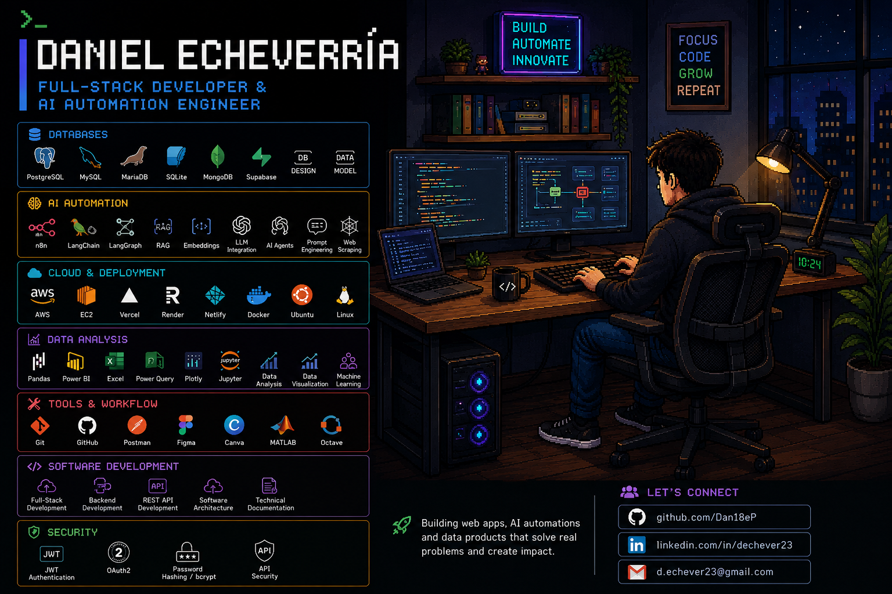

<div align="center">
  
</div>

<p align="center">
  
</p>

<p align="center">
  
  
  
</p>

---

## // ABOUT ME

> Systems Engineering student specializing in **Backend Architecture**, **Scalable APIs**, and **AI Automation Systems**. Focused on designing resilient services, clean relational data models, and high-throughput workflows that transform complex business logic into measurable value.

- **Specialization**: Backend architecture with **Python** (FastAPI, Flask), asynchronous systems, and database optimization.
- **AI Engineering**: Designing **RAG pipelines**, tool-calling AI agents, vector stores, and automated orchestration (LangChain, n8n).
- **Core Principles**: Clean Architecture, API-first design, strict data validation (Pydantic), and reproducible deployments with Docker.
- **Client-Side Support**: Secondary full-stack capabilities leveraging **TypeScript**, **Next.js**, and **React** when end-to-end delivery is required.

---

## // TECH STACK & SYSTEM ARCHITECTURE

<div align="center">
  
</div>

<br />

### 01. CORE & BACKEND ARCHITECTURE
```
Languages     : Python (Main), TypeScript, JavaScript, SQL, HTML5, CSS3
Frameworks    : FastAPI, Flask, Node.js, Express.js
ORM & Logic   : SQLAlchemy, Pydantic, REST APIs, Web Scraping, API Integration
Security      : JWT Authentication, OAuth2, Password Hashing (bcrypt), API Security
```


### 02. DATA PERSISTENCE & STORAGE
```
Relational    : PostgreSQL, MySQL, MariaDB, SQLite
Document / DB : MongoDB, Supabase
Engineering   : Database Design, Data Modeling, Schema Migrations, Indexing
```


### 03. AI ENGINEERING & AUTOMATION
```
Pipelines     : LangChain, LangGraph, RAG (Retrieval-Augmented Generation)
Intelligent   : AI Agents, Embeddings, LLM Integration, Prompt Engineering, n8n Workflows
```


### 04. CLOUD, CONTAINERS & INFRASTRUCTURE
```
Container     : Docker
Operating Sys : Linux / Ubuntu
Cloud / Host  : AWS EC2, Vercel, Render, Netlify
```


### 05. DATA ANALYSIS & SCIENTIFIC COMPUTING
```
Libraries     : Pandas, Plotly, Jupyter
Analytics     : Power BI, Power Query, Excel
Computing     : MATLAB, Octave, Machine Learning Fundamentals
```


### 06. CLIENT INTERFACES & FULL-STACK SUPPORT (Secondary)
```
Modern Web    : Next.js, React, Vite, Tailwind CSS, Bootstrap, Streamlit
```


### 07. WORKFLOW & SYSTEM ENGINEERING
```
Tools         : Git, GitHub, Postman, Figma, Canva
Disciplines   : Software Architecture, Technical Documentation, Team Leadership
```


---

## // WHAT I AM BUILDING

- **Scalable Backends & APIs**: Robust microservices and REST architectures with Python (FastAPI/Flask), strict schema enforcement, and relational consistency.
- **AI Agents & RAG Workflows**: Autonomous workflows, vector semantic search, and intelligent automation systems.
- **Data Engineering & Analytics**: High-efficiency ETL pipelines, automated reporting, and interactive data visualization.
- **Full-Stack Prototypes**: Fast-to-market web applications combining Python backends with Next.js / React client interfaces.

---

##  GITHUB METRICS & TELEMETRY

<p align="center">
  
</p>

<p align="center">
  
  
</p>

<p align="center">
  
</p>

---

## // LET'S CONNECT

<p align="center">
  <a href="https://github.com/Dan18eP"></a>
  <a href="https://www.linkedin.com/in/dechever23/"></a>
  <a href="mailto:d.echever23@gmail.com"></a>
</p>
